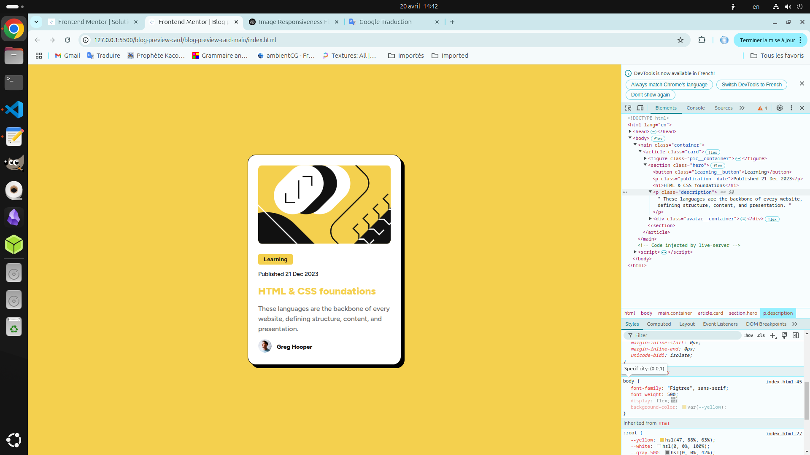

# Frontend Mentor - Blog preview card solution

This is a solution to the [Blog preview card challenge on Frontend Mentor](https://www.frontendmentor.io/challenges/blog-preview-card-ckPaj01IcS). Frontend Mentor challenges help you improve your coding skills by building realistic projects.

## Table of contents

- [Overview](#overview)
  - [The challenge](#the-challenge)
  - [Screenshot](#screenshot)
  - [Links](#links)
- [My process](#my-process)
  - [Built with](#built-with)
  - [What I learned](#what-i-learned)
  - [Continued development](#continued-development)
  - [Useful resources](#useful-resources)
- [Author](#author)
- [Acknowledgments](#acknowledgments)

**Note: Delete this note and update the table of contents based on what sections you keep.**

## Overview

### The challenge

Users should be able to:

- See hover and focus states for all interactive elements on the page

### Screenshot



### Links

- Solution URL: [solution URL here](https://github.com/art0fmind/frontend_mentor/tree/main/blog-preview-card/blog-preview-card-main/)
- Live Site URL: [live site URL here](https://art0fmind.github.io/frontend_mentor/blog-preview-card/blog-preview-card-main/)

## My process

### Built with

- Semantic HTML5 markup
- CSS custom properties
- Flexbox
- Mobile-first workflow

### What I learned

While working on this project, I delved into several key web development concepts, including:

#### ✅ **Dimension Management with CSS**

- I understood how to use `width` and `height` with the `fit-content` value, which allows an element to be sized based on its **actual content**, as opposed to fixed sizes.
- I also better understood the **difference between `auto` for `width` and `height`**:
- `width: auto` means that the width adapts to the content **up to filling the parent container** (often 100% if no other style limits it).
- `height: auto` means that the height automatically adjusts **based on the size of the content** inside, without forcing a defined height.

#### 🧠 **`<meta>` Tags and `<head>` Structure**

- I learned how to use `<meta name="author">` to indicate **the project author**, which can be useful for search engines or to lend credibility to my open source work.
- I also discovered the value of the `<link rel="preconnect">` tag, which allows the browser to **optimize performance** by initiating early connections to external resources (like Google Fonts).
- Finally, I used `<link href="https://fonts.googleapis.com/...">` to embed a **custom font (Figtree)** from Google Fonts, and I understood the value of the `display=swap` parameter to improve text rendering during loading.

---

🛠️ **This project allowed me to better understand how the HTML `head` works, CSS layout, as well as best practices for performance and accessibility.**

### Continued development

As mentioned previously I would like to have complete control over the width and height properties, not necessarily these properties but the implications they have with the other properties and also depending on the context.

### Useful resources

- [maadhav repo](https://github.com/maadhav-codes/fm-qr-code-component-solution)

Maadhav is another user on Frontend Monitor, and reading his solution for the QR code project helped me understand a few things, including the fact that it's often better to use
`box-sizing: border-box;` in the selector

```
* {
    margin: 0;
    padding: 0;
    box-sizing: border-box;
}
```

## Author

- Website - [art0fmind](https://github.com/art0fmind/)
- Frontend Mentor - [@art0fmind](https://www.frontendmentor.io/profile/art0fmind)
- Linkedin - [cedric midianga](https://www.linkedin.com/in/cedric-midianga-1738772b2/)

## Acknowledgments

Special thanks to my friend Maadhav for his original solution to the QR code challenge.
