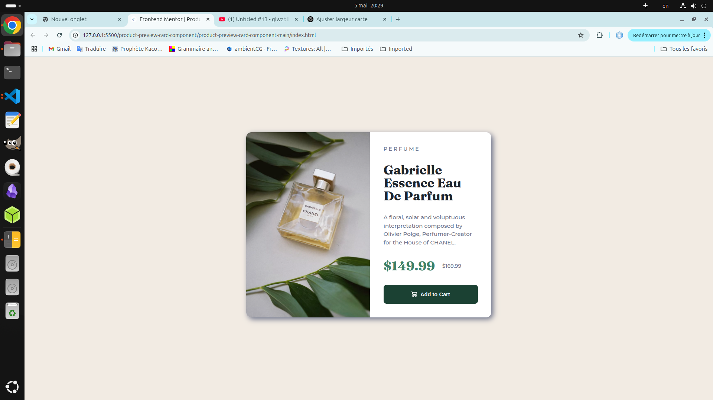
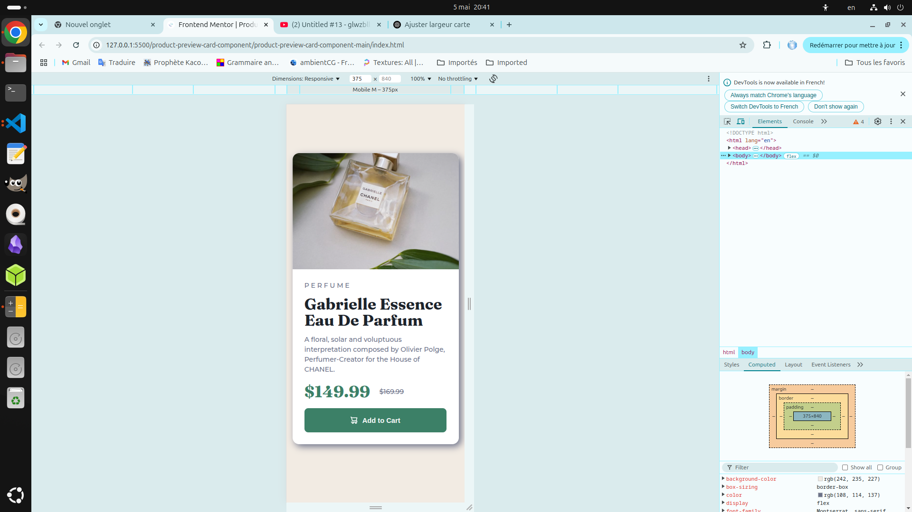

# Frontend Mentor - Product preview card component solution

_Solution bilingue / Bilingual solution_

This is a solution to the [Product preview card component challenge on Frontend Mentor](https://www.frontendmentor.io/challenges/product-preview-card-component-GO7UmttRfa). Frontend Mentor challenges help you improve your coding skills by building realistic projects.

---

Ceci est une solution au défi [Product preview card component sur Frontend Mentor](https://www.frontendmentor.io/challenges/product-preview-card-component-GO7UmttRfa). Les défis de Frontend Mentor vous aident à améliorer vos compétences en codant des projets réalistes.

---

## 📚 Table of contents / Table des matières

- [Overview / Aperçu](#overview--aperçu)
  - [The challenge / Le défi](#the-challenge--le-défi)
  - [Screenshot / Capture d'écran](#screenshot--capture-décran)
  - [Links / Liens](#links--liens)
- [My process / Mon processus](#my-process--mon-processus)
  - [Built with / Construit avec](#built-with--construit-avec)
  - [What I learned / Ce que j’ai appris](#what-i-learned--ce-que-jai-appris)
  - [Continued development / Développements futurs](#continued-development--développements-futurs)
  - [Useful resources / Ressources utiles](#useful-resources--ressources-utiles)
- [Author / Auteur](#author--auteur)
- [Acknowledgments / Remerciements](#acknowledgments--remerciements)

---

## 🧾 Overview / Aperçu

### ✅ The challenge / Le défi

Users should be able to:  
Les utilisateurs doivent pouvoir :

- View the optimal layout depending on their device's screen size  
  _Voir une mise en page optimisée selon la taille de l'écran de leur appareil_
- See hover and focus states for interactive elements  
  _Voir les états au survol (hover) et au focus pour les éléments interactifs_

---

### 🖼️ Screenshot / Capture d'écran

| Desktop                      | Mobile                        |
| ---------------------------- | ----------------------------- |
|  |  |

---

### 🔗 Links / Liens

- 💻 Solution URL : [Voir sur GitHub](https://www.github.com/art0fmind/frontend_mentor/tree/main/product-preview-card-component/product-preview-card-component-main/)
- 🌐 Live Site URL : [Voir en ligne](https://art0fmind.github.io/frontend_mentor/product-preview-card-component/product-preview-card-component-main/)

---

## 🔧 My process / Mon processus

### 🛠️ Built with / Construit avec

- Semantic HTML5 markup / HTML5 sémantique
- CSS custom properties / Propriétés CSS personnalisées
- Flexbox
- CSS Grid
- Mobile-first workflow / Approche mobile-first
- Media queries pour un design responsive / Media queries pour l’adaptabilité

---

### 💡 What I learned / Ce que j’ai appris

I reinforced my understanding of responsive design using `media queries`, and practiced creating flexible card layouts with `flexbox` and `grid`.

J’ai renforcé ma compréhension du design responsive grâce aux `media queries` et j’ai pratiqué la création de mises en page de cartes flexibles avec `flexbox` et `grid`.

#### Exemples de code / Code snippets

```css
@media (min-width: 768px) {
  .container {
    margin: auto;
    width: 100%;
    max-width: 660px;
  }

  .card {
    display: flex;
    flex-direction: row;
    border-radius: 1em;
    overflow: hidden;
    background-color: var(--white);
  }

  .image-product-desktop {
    display: block;
    height: 500px;
  }
  .image-product-mobile {
    display: none;
  }
}
```
