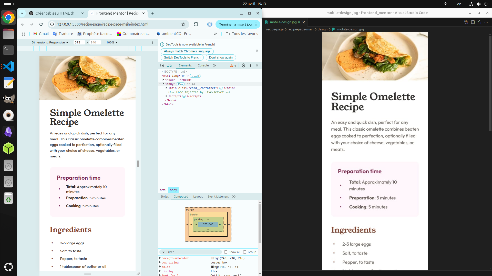
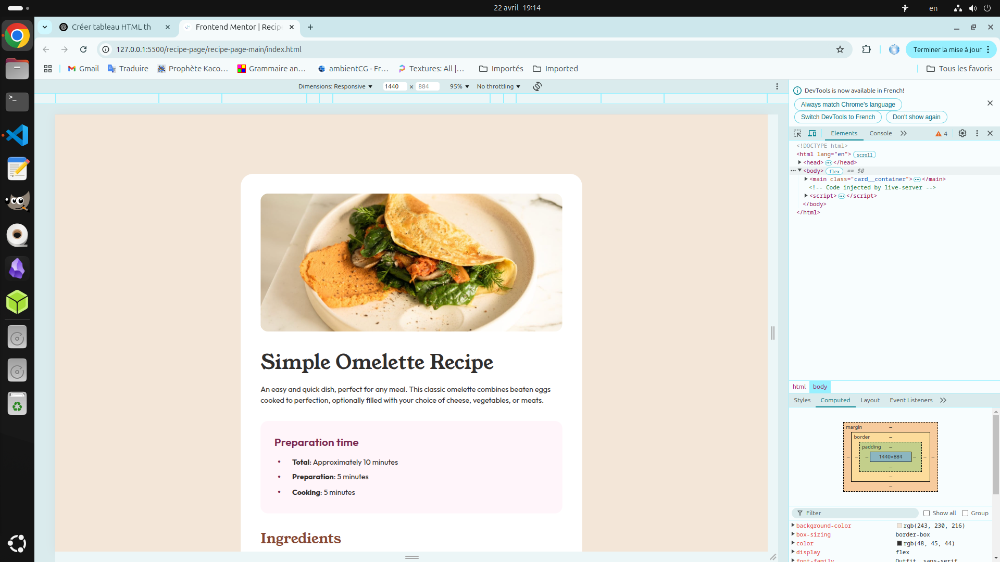

# Frontend Mentor - Recipe page solution

This is a solution to the [Recipe page challenge on Frontend Mentor](https://www.frontendmentor.io/challenges/recipe-page-KiTsR8QQKm). Frontend Mentor challenges help you improve your coding skills by building realistic projects.

## Table of contents

- [Overview](#overview)
  - [The challenge](#the-challenge)
  - [Screenshot](#screenshot)
  - [Links](#links)
- [My process](#my-process)
  - [Built with](#built-with)
  - [What I learned](#what-i-learned)
  - [Continued development](#continued-development)
- [Author](#author)
- [Acknowledgments](#acknowledgments)

## Overview

### The challenge

Users should be able to:

- See hover and focus states for all interactive elements on the page

### Screenshot

### Links

- URL de la solution : [URL de la solution ici](https://www.github.com/art0fmind/frontend_mentor/tree/main/recipe-page/recipe-page-main)
- URL du site en ligne : [URL du site en ligne ici](https://art0fmind.github.io/frontend_mentor/recipe-page/recipe-page-main)

## My process

### Built with

- Semantic HTML5 markup
- CSS custom properties
- Flexbox
- Grid
- Mobile-first workflow

### What I learned

I learned how to customize HTML lists using CSS Grid for more control over the layout. Specifically, I learned how to:

- Replace default list markers with custom ones using `::before` and Unicode characters (like `•`).
- Use `display: grid` on list items to align markers and content into two distinct columns.
- Center custom markers within their grid cell using properties like `align-items: center` and `position: relative`.
- Control spacing between items using `margin`, and inside items using `padding`.
- Understand and fix layout issues when text wraps onto multiple lines in `li` elements, ensuring clean and consistent indentation.

### Continued development

I want to keep improving my front-end skills by:

- Exploring how to animate custom markers or transitions on hover.
- Making the grid-based list layout more responsive for small screens.
- Trying the same layout using `flexbox` and comparing its behavior with `grid`.
- Applying these techniques to ordered lists (`ol`) with numbered counters for more advanced UI control.
- Creating reusable components or utility classes for styled lists to use across multiple sections of a site.

## Author

- Website - [art0fmind](https://github.com/art0fmind/)
- Frontend Mentor - [@art0fmind](https://www.frontendmentor.io/profile/art0fmind)
- Linkedin - [cedric midianga](https://www.linkedin.com/in/cedric-midianga-1738772b2/)

## Acknowledgments

Special thanks to my friend Maadhav for his original solution to the QR code challenge and also to the frontend mentor team.
