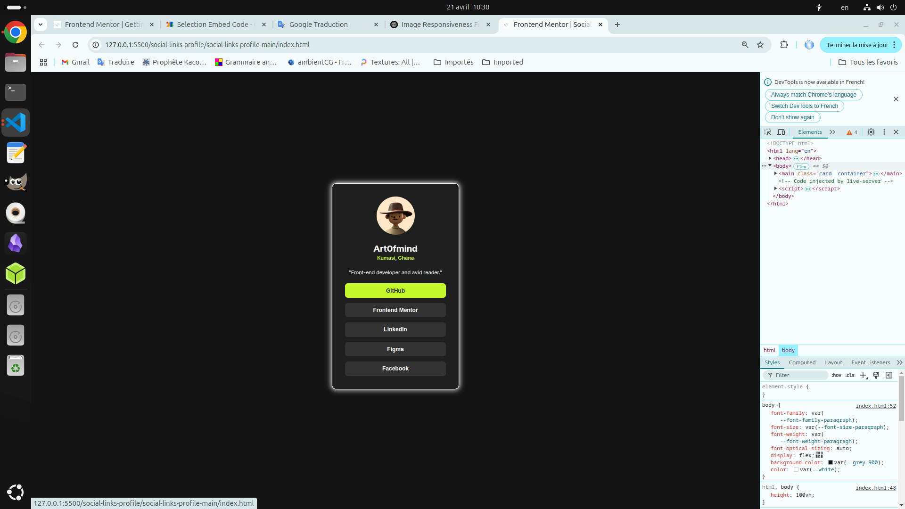

# README

# Mentor Frontend - Profil de liens sociaux


## Bienvenue ! 👋

Merci d'avoir participé à ce défi de codage front-end.

Les défis [Mentor Frontend](https://www.frontendmentor.io) vous aident à améliorer vos compétences en codage en créant des projets réalistes.

**Pour relever ce défi, vous devez avoir des notions de base en HTML et CSS.**

## Le défi

Votre défi consiste à créer ce profil de liens sociaux et à le rendre aussi fidèle que possible au design.

Vous pouvez utiliser les outils de votre choix pour relever ce défi. Si vous souhaitez vous entraîner sur un point, n'hésitez pas à le faire.

Vos utilisateurs devraient pouvoir :

- Voir les états de survol et de focus de tous les éléments interactifs de la page

Besoin d'aide pour ce défi ? Rejoignez notre communauté (https://www.frontendmentor.io/community) et posez vos questions sur le canal **#help**.

## Où trouver tout le contenu ?

Votre tâche consiste à développer le projet et à intégrer les designs dans le dossier « /design ». Vous trouverez une version mobile et une version ordinateur.

Les designs sont au format JPG statique. L'utilisation de fichiers JPG nécessite de faire preuve de discernement pour les styles tels que « font-size », « padding » et « margin ».

Si vous souhaitez consulter les fichiers de design (versions Sketch et Figma disponibles) afin d'examiner le design plus en détail, vous pouvez vous abonner en tant que membre PRO (https://www.frontendmentor.io/pro).

Tous les éléments nécessaires à ce projet se trouvent dans le dossier « /assets ». Les images sont déjà exportées à la bonne taille d'écran et optimisées.

Nous incluons également des fichiers de polices variables et statiques pour les polices requises pour ce projet. Vous pouvez choisir d'utiliser un lien vers Google Fonts ou d'utiliser les fichiers de polices locaux pour héberger les polices vous-même. Veuillez noter que nous avons supprimé les fichiers de polices statiques pour les graisses inutiles pour ce projet.

Un fichier « style-guide.md » contient également les informations nécessaires, telles que la palette de couleurs et les polices.

## Création de votre projet

N'hésitez pas à utiliser le flux de travail qui vous convient. Vous trouverez ci-dessous une suggestion de processus, mais ne vous sentez pas obligé de suivre ces étapes :

1. Initialisez votre projet en tant que dépôt public sur [GitHub](https://github.com/). Créer un dépôt facilitera le partage de votre code avec la communauté si vous avez besoin d'aide. En cas de doute, consultez cette ressource « Try Git » (https://try.github.io/).
2. Configurez votre dépôt pour publier votre code sur une adresse web. Cela vous sera également utile si vous avez besoin d'aide lors d'un défi, car vous pouvez partager l'URL de votre projet avec l'URL de votre dépôt. Il existe plusieurs façons de procéder, et nous vous proposons quelques recommandations ci-dessous.
3. Examinez les designs pour commencer à planifier la manière dont vous allez aborder le projet. Cette étape est cruciale pour anticiper les classes CSS et créer des styles réutilisables.
4. Avant d'ajouter des styles, structurez votre contenu avec du HTML. Rédiger votre code HTML au préalable peut vous aider à vous concentrer sur la création d'un contenu bien structuré.
5. Définissez les styles de base de votre projet, y compris les styles de contenu généraux, tels que « font-family » et « font-size ».
6. Commencez à ajouter des styles en haut de la page, puis continuez vers le bas. Ne passez à la section suivante qu'une fois que vous êtes satisfait d'avoir terminé la zone sur laquelle vous travaillez.

## Déploiement de votre projet

Comme mentionné précédemment, il existe de nombreuses façons d'héberger votre projet gratuitement. Nos hébergeurs recommandés sont :

- [GitHub Pages](https://pages.github.com/)
- [Vercel](https://vercel.com/)
- [Netlify](https://www.netlify.com/)

Vous pouvez héberger votre site avec l'une de ces solutions ou l'un de nos autres hébergeurs de confiance. [En savoir plus sur nos hébergeurs recommandés et de confiance](https://medium.com/frontend-mentor/frontend-mentor-trusted-hosting-providers-bf000dfebe).

## Créer un fichier « README.md » personnalisé

Nous vous recommandons vivement de remplacer ce fichier « README.md » par un fichier personnalisé. Nous fournissons un modèle dans le fichier [`README-template.md`](./README-template.md) de ce code de démarrage.

Ce modèle fournit un guide sur les éléments à ajouter. Un fichier « README » personnalisé vous aidera à expliquer votre projet et à mettre en lumière vos apprentissages. N'hésitez pas à modifier notre modèle autant que vous le souhaitez.

Une fois vos informations ajoutées au modèle, supprimez ce fichier et renommez le fichier « README-template.md » en « README.md ». Il apparaîtra alors comme fichier README de votre dépôt.

## Soumettre votre solution

Soumettez votre solution sur la plateforme pour que le reste de la communauté puisse la consulter. Suivez notre [« Guide complet pour soumettre des solutions »](https://medium.com/frontend-mentor/a-complete-guide-to-submitting-solutions-on-frontend-mentor-ac6384162248) pour obtenir des conseils.

N'oubliez pas : si vous souhaitez obtenir des commentaires sur votre solution, n'hésitez pas à poser des questions lors de la soumission. Plus vos questions seront précises et détaillées, plus vous aurez de chances d'obtenir des retours utiles de la communauté.

## Partager votre solution

Vous pouvez partager votre solution de plusieurs manières :

1. Partagez votre page de solution sur le canal **#finished-projects** de notre [communauté](https://www.frontendmentor.io/community).
2. Tweetez [@frontendmentor](https://twitter.com/frontendmentor) et mentionnez **@frontendmentor**, en incluant le dépôt et les URL actives dans le tweet. Nous aimerions découvrir ce que vous avez créé et vous aider à le partager.
3. Partagez votre solution sur d'autres réseaux sociaux comme LinkedIn.
4. Bloguez sur votre expérience de développement de projet. Décrire votre flux de travail, vos choix techniques et discuter de votre code est un excellent moyen de consolider vos connaissances. [dev.to](https://dev.to/), [Hashnode](https://hashnode.com/) et [CodeNewbie](https://community.codenewbie.org/) sont d'excellentes plateformes pour écrire.

Nous fournissons des modèles pour vous aider à partager votre solution une fois soumise sur la plateforme. N'hésitez pas à les modifier et à inclure des questions précises si vous souhaitez obtenir des commentaires.

Plus vos questions sont précises, plus vous avez de chances d'obtenir des commentaires d'un autre membre de la communauté.

## Vous avez des commentaires ?

Nous adorons recevoir vos commentaires ! Nous cherchons constamment à améliorer nos défis et notre plateforme. Si vous avez des suggestions, n'hésitez pas à nous contacter par e-mail à hi[at]frontendmentor[dot]io.

Ce défi est entièrement gratuit. Partagez-le avec toute personne susceptible de s'entraîner.

**Amusez-vous bien !** 🚀

# style-guide

# Front-end Style Guide

## Layout

The designs were created to the following widths:

- Mobile: 375px
- Desktop: 1440px

> 💡 These are just the design sizes. Ensure content is responsive and meets WCAG requirements by testing the full range of screen sizes from 320px to large screens.

## Colors

- Green: hsl(75, 94%, 57%)

- White: hsl(0, 0%, 100%)

- Grey 700: hsl(0, 0%, 20%)
- Grey 800: hsl(0, 0%, 12%)
- Grey 900: hsl(0, 0%, 8%)

## Typography

### Body Copy

- Font size (paragraph): 14px

### Font

- Family: [Inter](https://fonts.google.com/specimen/Inter)
- Weights: 400, 600, 700

> 💎 [Upgrade to Pro](https://www.frontendmentor.io/pro?ref=style-guide) for design file access to see all design details and get hands-on experience using a professional workflow with tools like Figma. The design file for this challenge also includes a basic design system to help you build a more accurate solution faster.

# README-template

# Frontend Mentor - Solution pour le profil de liens sociaux

Voici la solution au défi « Profil de liens sociaux » sur Frontend Mentor : https://www.frontendmentor.io/challenges/social-links-profile-UG32l9m6dQ. Les défis Frontend Mentor vous aident à améliorer vos compétences en codage en créant des projets réalistes.

## Table des matières

- [Aperçu](#aperçu)
- [Le ​​défi](#le-défi)
- [Capture d'écran](#capture-d'écran)
- [Liens](#liens)
- [Mon processus](#mon-processus)
- [Construit avec](#construit-avec)
- [Ce que j'ai appris](#ce-que-j'ai-appris)
- [Développement continu](#développement-continu)
- [Ressources utiles](#ressources-utiles)
- [Auteur](#auteur)
- [Remerciements](#remerciements)

**Remarque : Supprimez cette note et mettez à jour la table des matières en fonction des sections que vous conservez.**

## Aperçu

### Le défi

Les utilisateurs devraient pouvoir :

- Voir les états de survol et de focus de tous les éléments interactifs de la page

### Capture d'écran



### Liens

- URL de la solution : [URL de la solution ici](https://www.github.com/art0fmind/frontend_mentor/tree/main/social-links-profile/social-links-profile-main)
- URL du site en ligne : [URL du site en ligne ici](https://art0fmind.github.oi/frontend_mentor/social-links-profile/social-links-profile-main)

## Ma démarche

### Créé avec

- Balisage HTML5 sémantique
- Propriétés CSS personnalisées
- Flexbox
- Grille CSS
- Workflow mobile-first
- [React](https://reactjs.org/) - Bibliothèque JavaScript
- [Next.js](https://nextjs.org/) - Framework React
- [Composants stylisés](https://styled-components.com/) - Pour les styles

**Remarque : Ce ne sont que des exemples. Supprimez cette note et remplacez la liste ci-dessus par vos propres choix.**

### Ce que j'ai appris

Utilisez cette section pour récapituler les principaux enseignements que vous avez tirés de ce projet. Les écrire et fournir des exemples de code des points que vous souhaitez mettre en avant est un excellent moyen de renforcer vos connaissances.

Pour découvrir comment ajouter des extraits de code, voir ci-dessous :

```html
<h1>Un peu de code HTML dont je suis fier</h1>
```

```css
.proud-of-this-css {
  color: papayawhip;
}
```

```js
const proudOfThisFunc = () => {
  console.log("🎉");
};
```

Si vous avez besoin d'aide pour écrire du Markdown, nous vous recommandons de consulter le [Guide Markdown](https://www.markdownguide.org/) pour en savoir plus.

**Remarque : Supprimez cette note et le contenu de cette section et remplacez-les par vos propres connaissances.**

### Développement continu

Utilisez cette section pour décrire les points sur lesquels vous souhaitez continuer à vous concentrer dans vos futurs projets. Il peut s'agir de concepts avec lesquels vous n'êtes pas encore totalement à l'aise ou de techniques que vous avez trouvées utiles et que vous souhaitez affiner et perfectionner.

**Remarque : Supprimez cette note et le contenu de cette section et remplacez-les par vos propres plans de développement.**

### Ressources utiles

- [Exemple de ressource 1](https://www.example.com) - Cet article m'a été utile pour la raison XYZ. J'ai beaucoup aimé ce modèle et je l'utiliserai à l'avenir.
- [Exemple de ressource 2](https://www.example.com) - Cet article est formidable et m'a permis de comprendre enfin XYZ. Je le recommande à tous ceux qui apprennent encore ce concept.

**Remarque : Supprimez cette note et remplacez la liste ci-dessus par les ressources qui vous ont aidé pendant le défi. Ces informations pourraient s'avérer utiles à toute personne consultant votre solution, ou à vous-même, lorsque vous reviendrez sur ce projet ultérieurement.**

## Auteur

- Site web - [Ajoutez votre nom ici](https://www.votre-site.com)
- Mentor Frontend - [@votrenomdutilisateur](https://www.frontendmentor.io/profile/votrenomdutilisateur)
- Twitter - [@votrenomdutilisateur](https://www.twitter.com/votrenomdutilisateur)

**Remarque : Supprimez cette note et ajoutez/supprimez/modifiez les lignes ci-dessus en fonction des liens que vous souhaitez partager.**

## Remerciements

Vous pouvez remercier ici tous ceux qui vous ont aidé sur ce projet. Vous avez peut-être travaillé en équipe ou vous êtes inspiré de la solution de quelqu'un d'autre ? C'est l'endroit idéal pour les remercier.

**Remarque : Supprimez cette note et modifiez le contenu de cette section si nécessaire. Si vous avez relevé ce défi seul, n'hésitez pas à supprimer entièrement cette section.**
